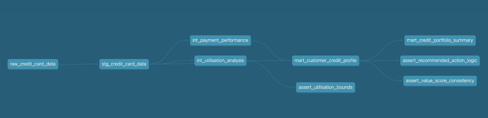

# 💳 Credit Payment Analytics Pipeline

[](https://www.getdbt.com/)
[](https://cloud.google.com/bigquery)
[](https://www.python.org/)

## 📊 Overview
A comprehensive dbt project that analyses credit card payment behaviour to identify customers eligible for improved credit terms. Built as a portfolio project demonstrating advanced data transformation and business logic implementation skills.

## 🎯 Business Context
Traditional credit scoring focuses on risk minimisation. This project takes a **lender's perspective**, identifying profitable customers (revolvers) who generate interest revenue whilst maintaining acceptable risk levels.

### 💰 Key Business Insight
> "Good customers pay eventually. Great customers pay forever (in interest)."

## 📈 Data Source
- **Dataset**: UCI Credit Card Clients Dataset (2005)
- **Size**: 30,000 customers
- **Period**: 6 months of payment history
- **Location**: Taiwan (amounts in NT$)

## 🏗️ Architecture

### Data Flow
```
seeds/                → Raw CSV data
  ↓
staging/              → Decoded categorical variables  
  ↓
intermediate/         → Business calculations
  ↓
marts/               → Decision-ready tables
```


## 🧮 Key Business Logic

### Customer Value Score (0-100)
Prioritises profitable customers over "deadbeats" (those who pay in full):

| Score Range | Customer Type | Business Action |
|------------|---------------|-----------------|
| 🟢 80-100 | High-value revolvers | Increase limits |
| 🟡 40-60 | Acceptable risk | Maintain |
| 🔴 0-40 | High-risk segments | Review account |

### 📊 Utilisation Analysis
- ✅ Tracks credit usage patterns and volatility
- ✅ Identifies over-limit incidents
- ✅ Flags capacity for credit increases

## 📂 Models

| Model | Type | Purpose | Records |
|-------|------|---------|---------|
| `stg_credit_card_data` | View | Transforms numeric codes to readable text | 30,000 |
| `int_payment_performance` | Table | Calculates payment reliability and customer value | 30,000 |
| `int_utilisation_analysis` | Table | Analyses credit usage patterns | 30,000 |
| `mart_customer_credit_profile` | Table | Complete customer view for decisions | 30,000 |
| `mart_credit_portfolio_summary` | Table | Executive dashboard by risk segment | 4 |

## 🚀 Setup & Usage

### Prerequisites
- ✅ Python 3.8+
- ✅ dbt-core 1.10+
- ✅ Google BigQuery account
- ✅ Git

### 📦 Installation
```bash
# Clone repository
git clone https://github.com/yourusername/credit-payment-analytics.git
cd credit-payment-analytics

# Create virtual environment
python -m venv venv
source venv/bin/activate  # On Windows: venv\Scripts\activate

# Install dependencies
pip install -r requirements.txt

# Configure BigQuery connection
# Update ~/.dbt/profiles.yml with your credentials
```

### 🏃 Running the Pipeline
```bash
# Load raw data
dbt seed

# Run all transformations
dbt run

# Run tests
dbt test
```

## 📊 Interactive Documentation

Full interactive documentation is available via dbt docs:

```bash
# Generate documentation
dbt docs generate

# View interactive documentation with DAG
dbt docs serve
# Opens at http://localhost:8080
```

The documentation includes:
- Interactive DAG (Directed Acyclic Graph) of all models
- Model and column descriptions
- Test results and data lineage
- Searchable interface for all project components


## 📊 Key Findings

### Portfolio Distribution

| Segment | % Customers | Action |
|---------|-------------|--------|
| 📈 Growth Eligible | 8.3% | Increase |
| ✅ Stable | 60.0% | Maintain |
| ⚠️ Monitor | 23.3% | Watch |
| 🚨 High Risk | 8.3% | Review |
```

## 🧪 Testing Strategy

### Test Coverage
- ✅ **16 tests** implemented
- ✅ Uniqueness constraints
- ✅ Not null validations
- ✅ Accepted value checks
- ✅ Custom business logic tests
- ✅ Positive value validations

### Test Results
```bash
Completed successfully
================== 
✓ 27 tests passed
✗ 0 tests failed
⚠ 0 warnings
```

## 🔮 Future Enhancements
- [ ] Add incremental loading for production scale
- [ ] Implement Looker Studio dashboard
- [ ] Add ML-based risk prediction
- [ ] Include time-series trend analysis
- [ ] Create API endpoints for real-time scoring

## 🛠️ Technologies Used


## 📁 Project Structure
```
credit_payment_analytics/
├── 📂 models/
│   ├── 📂 staging/
│   │   └── 📄 stg_credit_card_data.sql
│   ├── 📂 intermediate/
│   │   ├── 📄 int_payment_performance.sql
│   │   └── 📄 int_utilisation_analysis.sql
│   ├── 📂 marts/
│   │   ├── 📄 mart_customer_credit_profile.sql
│   │   └── 📄 mart_credit_portfolio_summary.sql
│   └── 📄 schema.yml
├── 📂 seeds/
│   └── 📄 raw_credit_card_data.csv
├── 📂 tests/
│   ├── 📄 assert_value_score_consistency.sql
│   └── 📄 assert_recommended_action_logic.sql
├── 📂 macros/
│   └── 📄 test_positive_values.sql
├── 📄 dbt_project.yml
├── 📄 requirements.txt
└── 📄 README.md
```

## 📧 Contact
- **GitHub**: [bergerache](https://github.com/bergerache)
- **LinkedIn**: [rachel-berger-data](https://linkedin.com/in/rachel-berger-data)
- **Email**: bergerache@gmail.com

---

<p align="center">
  Made with ❤️ using dbt
</p>
